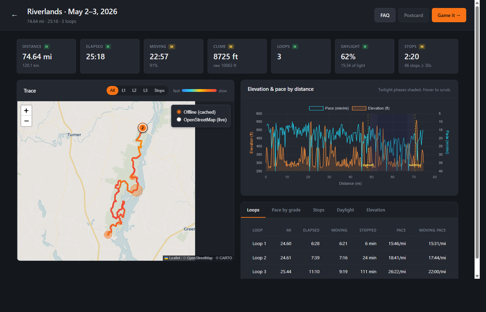
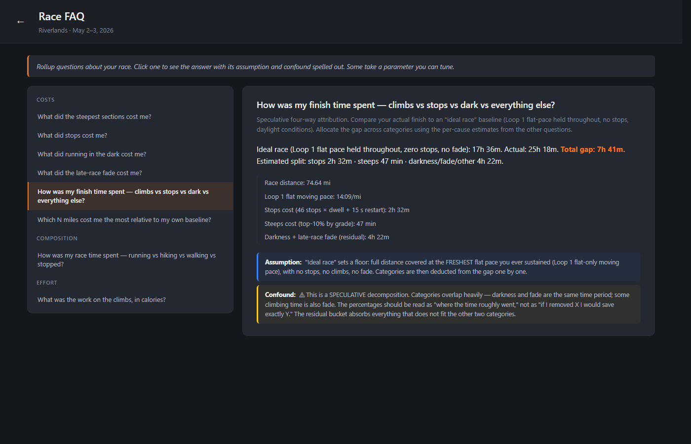

# Riverlands Tribute

A static-web prototype that turns a single GPX file from a long trail race into:

- an **analysis dashboard** with map, elevation/pace timeline, drill-down tabs, and confidence-labeled metrics
- **Re-Run**, a counterfactual *"what if I'd held a different pace"* game with a banded pool model
- a **race FAQ** answering rolled-up attribution questions — *what did the steepest sections cost me, what did stops cost me, how was my finish time spent across stops vs steeps vs darkness vs everything else?*

Built around a single race: a 74.6-mile, 25 h 18 m, three-loop run at Androscoggin Riverlands State Park in Maine on May 2–3, 2026.



The prototype is fully client-side — no API keys, no database, no cloud services. The map is offline by default (~730 KB of pre-cached tiles in the repo); a toggle switches to live OpenStreetMap if you want richer detail.



## How to run it

The app lives in `experiment1/prototype/`. It works in three ways: a one-click launcher, a manual Python invocation, or any static HTTP server you already have.

### Windows — one click

Double-click `experiment1/prototype/serve.bat`. It checks that Python is installed, installs `fastapi` + `uvicorn` on first run, frees port 8765 if a stale server is holding it, and opens your browser at `http://localhost:8765/`. Diagnostic log in `experiment1/prototype/serve.log` if anything goes wrong.

### macOS / Linux — one command

```bash
cd experiment1/prototype
./serve.sh
```

Same flow as Windows. (If you get *"Permission denied,"* run `chmod +x serve.sh` once.)

### Any platform — manually

```bash
cd experiment1/prototype
pip install -r requirements.txt
python server.py
```

The browser opens automatically after ~1.5 seconds. Pass `--no-browser` to suppress.

### No Python? Any static HTTP server works

The prototype is fully client-side; the FastAPI launcher is just convenient. Anything that serves the `experiment1/prototype/` directory over HTTP will run the app:

```bash
cd experiment1/prototype
python3 -m http.server 8765      # built-in Python
# or
npx http-server -p 8765          # if you have Node
```

Then open `http://localhost:8765/`.

> ⚠ **Don't double-click `index.html`.** Browsers block ES module imports over `file://`. The page renders but no JavaScript runs. The launcher / static server path is required.

## Live demo

The prototype is also deployed to GitHub Pages. After enabling Pages in this repo's *Settings → Pages → Build and deployment → GitHub Actions*, the workflow at `.github/workflows/pages.yml` publishes `experiment1/prototype/` to:

```
https://nate-badsciencefiction.github.io/Riverlands/
```

Same code, no install needed. (The live OSM tile toggle is more useful in the deployed version since you're not constrained to the cached bbox.)

## What's where

```
.
├── README.md                   # this file
├── LICENSE                     # MIT
├── media/                      # screenshots used by READMEs
├── .github/workflows/pages.yml # GitHub Pages deployment
└── experiment1/
    └── prototype/              # the running app
        ├── README.md           # focused on running and testing
        ├── index.html
        ├── app.js              # state, view routing, rendering
        ├── styles.css
        ├── server.py + serve.bat + serve.sh
        ├── requirements.txt
        ├── lib/                # gpx, metrics, inflections, rerun, postcard, faq
        ├── vendor/             # Leaflet, Chart.js, suncalc, pre-cached map tiles
        ├── data/Riverlands.gpx # test fixture
        ├── scripts/cache_tiles.py  # tile pre-fetcher (re-runnable)
        └── tests/              # 22 synthetic + 24 Node + 25 browser assertions
```

## How it was built

The prototype is vanilla HTML / CSS / JavaScript — no framework, no build step. ES modules in the source (`lib/*.js`); classic `<script>` tags for vendored libraries. Map via [Leaflet](https://leafletjs.com); charts via [Chart.js](https://chartjs.org); sun/twilight calculations via [suncalc](https://github.com/mourner/suncalc). Map tiles are pre-cached from [CARTO Voyager](https://carto.com/basemaps/) for offline operation; live OpenStreetMap is available as a layer toggle.

Tests run in three places:

| Suite | Where | What it checks |
|---|---|---|
| `tests/synthetic.test.mjs` | Node | 22 assertions on synthetic fixtures (no-elevation, no-time, point-to-point, two-loop, etc.) |
| `tests/node-runner.mjs`    | Node | 24 assertions on the Riverlands GPX (verified-numbers acceptance gate) |
| `tests/test-runner.html`   | Browser | 25 assertions including a SunCalc-dependent astronomical check |

Run them:

```bash
cd experiment1/prototype
node tests/synthetic.test.mjs
node tests/node-runner.mjs
# Browser suite: open http://localhost:8765/tests/test-runner.html
```

## License

[MIT](LICENSE).

The bundled libraries (Leaflet, Chart.js, chartjs-plugin-annotation, suncalc) are MIT-licensed and redistributable. The pre-cached map tiles in `experiment1/prototype/vendor/tiles/` are © OpenStreetMap contributors and © CARTO; redistributable for non-commercial use with attribution (which is wired into the map's attribution control).

The bundled `Riverlands.gpx` records the route of a public trail in a Maine state park; no private data.

## Acknowledgements

- Built collaboratively by **Nate Combs** and [**Claude Code**](https://claude.com/claude-code) (Anthropic's CLI for Claude). Most of the code and the prose in this README were authored together.
- Trail and analysis substrate: [Androscoggin Riverlands State Park](https://www.maine.gov/dacf/parks/find_parks_and_lands/index.shtml) and the [Riverlands trail running events](https://www.mainetrailseries.com/) that take place there
- Map data: [OpenStreetMap contributors](https://www.openstreetmap.org/copyright)
- Map style: [CARTO Voyager basemap](https://carto.com/basemaps/)
- Sun/twilight math: [Vladimir Agafonkin's SunCalc](https://github.com/mourner/suncalc)
